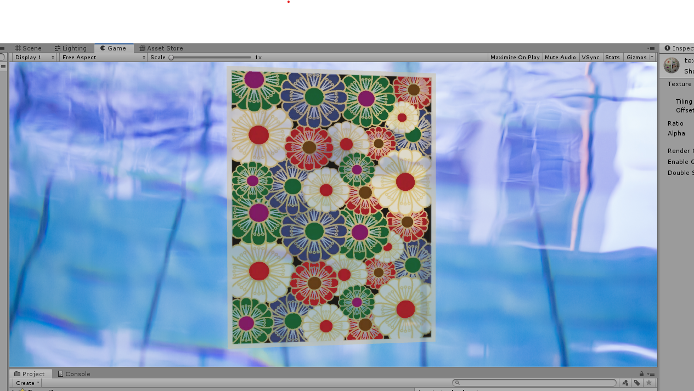

# 2019/0704 テクスチャ(という名の画像処理)

## before


## after


## gray_scale


## シェーダー

[texture.shader](../../texture.shader)

[grayscale.shader](../../grayscale.shader)

## やったこと

Unityのテクスチャはシェーダーで用いると画像をそのまま張り付けるのではなく, ```1ピクセルごとにrgb情報を読み込んで処理をする```

そして, 1ピクセルごとにrgb情報を取得できるので簡単な画像処理であればシェーダーで実装可能

今回使ったのはグレースケールの変換で有名な式を使いました

変換式 : ```(0.299 * R + 0.587 * G + 0.114 * B)```

でafterは何をしているかというと(わかりずらいのですが)黒に近ければ透明度を下げ, 白日かければ透明度を上げています.

この閾値と透明度をプロパティから設定できるようにして遊んでみたというところです.
