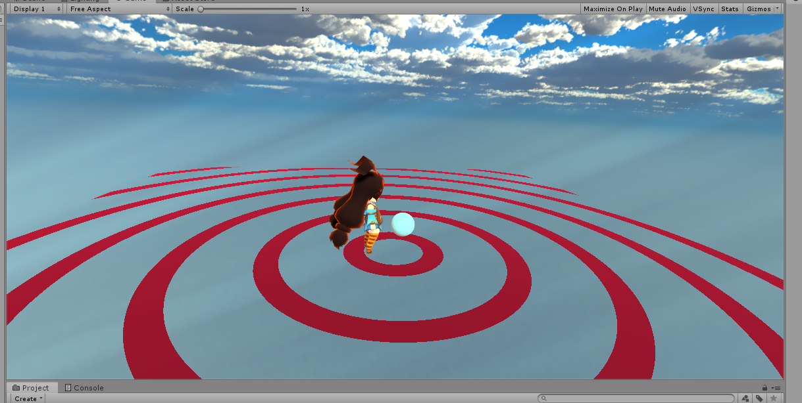

# 2019/0704 uv座標でアニメーション(しているように見せる処理)

## after


## result


## シェーダー

[circle.shader](../../circle.shader)

オブジェクトの中心座標をシェーダーに渡すスクリプト

[PositionPost.cs](../../PositionPost.cs)

## やったこと

Unityのシェーダーは1ピクセルごとに描画を行うので, ピクセルの位置によって描画方法を変えれば模様も書くことができる

afterの図は, 「中心からの距離をxとしてsin関数の変数とし, プロパティで指定した閾値を超えた部分だけ色をつける」といった処理を行うことで描いています.

で, この描画位置を_Timeという時間によって値が変化するUnityのマクロを使って動的に変化するようにしたのが今回作成したアニメーションといった感じです.

sin内部で反比例を使用することで外側 → 内側に向かって角度の倍数が大きくなるので内側ほど円が詰まってスピードが遅くなっているかのように見せています(適当にいじってたらたまたまこの式にたどり着いた).

```sin((3 / 中心からの距離) * 補助係数 - _Time * 100)```
